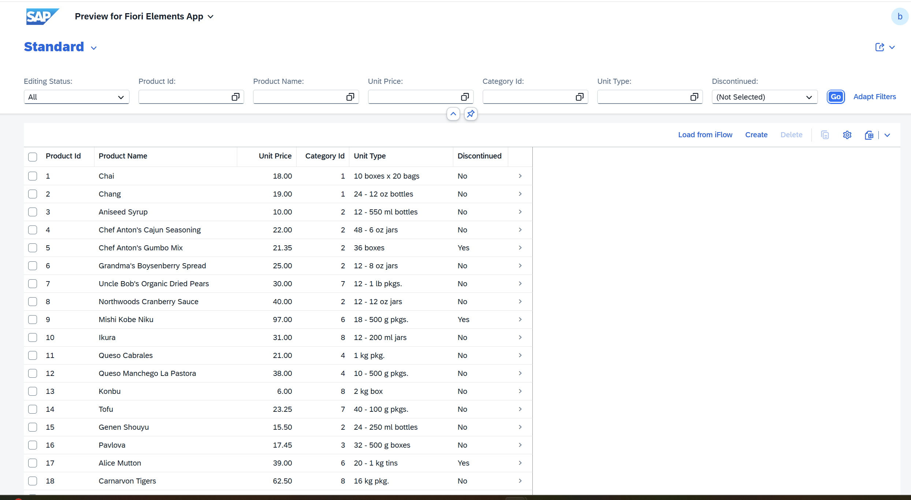
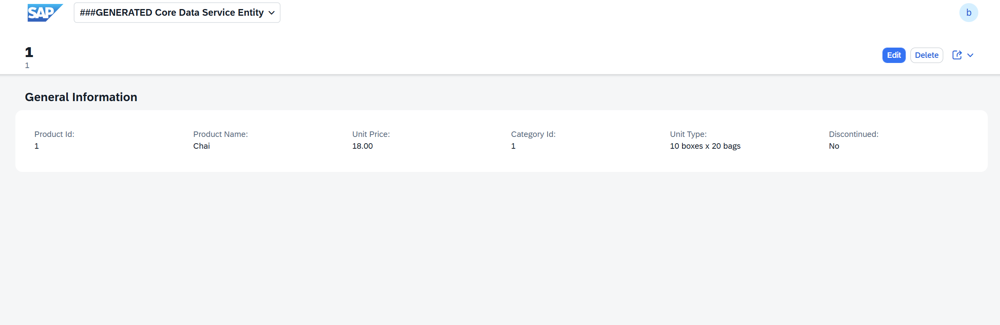
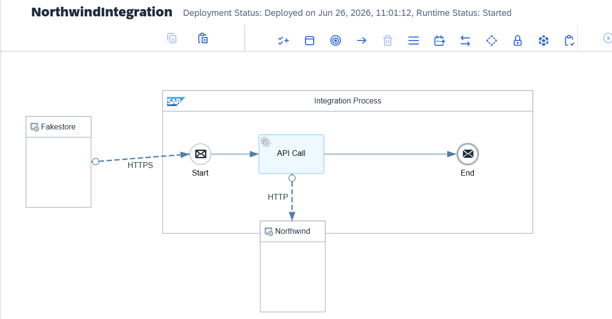

# ZFAKESTORE — Northwind End-to-End Integration

Dieses Projekt zeigt eine vollständige End-to-End-Integration in der SAP-Welt:  
Produktdaten werden über die **SAP Integration Suite** von der externen **Northwind OData V2 API** abgerufen, in einer **SAP HANA Datenbank** mit 
Draft-Unterstützung gespeichert und über eine **SAP Fiori Elements App** angezeigt.

> Der Projektname *ZFakeStore* ist historisch — die tatsächlich aufgerufene API ist der öffentliche **Northwind OData V2 Service** von Microsoft.

---

## Technologien

**SAP**
- ABAP Cloud (Clean-Core-Ansatz)
- RESTful Application Programming Model (RAP)
- CDS Views
- SAP Fiori Elements
- SAP Integration Suite
- OData V4
- SAP HANA

**Integration**
- OData V2 / REST API
- JSON
- HTTP

**Entwicklung & Tools**
- Eclipse ADT
- Git / abapGit
- SAP BTP ABAP Environment

---

## Funktionsumfang

- Abruf von Produktdaten aus der Northwind REST API
- Integration über SAP Integration Suite (iFlow)
- Speicherung der Daten in einer benutzerdefinierten SAP-Datenbanktabelle (`ZNWPRODUCTS_D`)
- Modellierung eines vollständigen RAP Business Objects mit Draft-Unterstützung
- Bereitstellung eines OData V4 Services
- Anzeige der Produktdaten in einer SAP Fiori Elements-Anwendung (List Report + Object Page)
- Umsetzung nach dem **Clean-Core-Ansatz**

---

## Architektur

<!--  -->

```
┌───────────────────────────────────────────────┐
│           SAP Fiori Elements                  │
│        List Report · Object Page (Draft)      │
└────────────┬──────────────────────────────────┘
             │ OData V4
┌────────────▼────────────────────────────────────────┐
│  ZUI_NWPRODUCTS_O4   ZC_NWPRODUCTS   ZR_NWPRODUCTS  │
│  Service Binding   Projection View   View Entity    │
│  (OData V4)        + Behavior        + Behavior     │
└────────────┬────────────────────────────────────────┘
             │ HTTP-Aufruf via SAP Integration Suite
┌────────────▼──────────────────────────────────┐
│           SAP Integration Suite               │
│      iFlow · Cloud Communication Mgmt         │
└────────────┬──────────────────────────────────┘
             │ OData V2
┌────────────▼──────────────────────────────────┐
│           Northwind OData V2 API              │
│   services.odata.org/V2/Northwind/Products    │
└────────────┬──────────────────────────────────┘
             │ Persistenz
┌────────────▼──────────────────────────────────┐
│           ZNWPRODUCTS_D (SAP HANA)            │
│           Draft Database Table                │
└───────────────────────────────────────────────┘
```

---

## Projektablauf

1. Die **SAP Integration Suite** ruft Produktdaten über die **Northwind OData V2 API** ab.
2. Die Daten werden im **JSON-Format** verarbeitet und transformiert.
3. Die Anwendung speichert die Daten in der SAP-Datenbanktabelle **`ZNWPRODUCTS_D`**.
4. Ein **RAP Business Object** stellt die Daten über einen **OData V4 Service** bereit.
5. Die **SAP Fiori Elements-Anwendung** liest die Daten und stellt sie dem Benutzer übersichtlich dar.

---

## Screenshots

> Screenshots befinden sich im Ordner `docs/screenshots/`.

### Fiori List Report

<!--  -->

### Fiori Object Page

<!--  -->

### iFlow — SAP Integration Suite

<!--  -->

---

## Artefakte

### Package: `ZFAKESTORE` → `ZFAKESTORE_RAP_NEU`

| Artefakt | Typ | Beschreibung |
|---|---|---|
| `ZNWPRODUCTS_D` | Database Table | Draft-fähige HANA-Tabelle für Produktdaten |
| `ZR_NWPRODUCTS` | CDS View Entity | Root Business Object (View auf `ZNWPRODUCTS_D`) |
| `ZC_NWPRODUCTS` | CDS Projection View | Consumption View für Fiori |
| `ZR_NWPRODUCTS` | Behavior Definition | Behavior des Root BO (inkl. Draft-Handling) |
| `ZC_NWPRODUCTS` | Projection Behavior | Behavior-Projektion für den Service |
| `ZC_NWPRODUCTS` | Metadata Extension | Fiori-Annotationen (UI-Labels, Selectionfields) |
| `ZC_NWPRODUCTS` | Access Control | DCL für die Consumption View |
| `ZR_NWPRODUCTS` | Access Control | DCL für die Root View Entity |
| `ZUI_NWPRODUCTS_O4` | Service Definition | Servicedefinition für `ZC_NWPRODUCTS` |
| `ZUI_NWPRODUCTS_O4` | Service Binding | OData V4 Binding (UI) |

---

## Voraussetzungen

- SAP BTP ABAP Environment oder S/4HANA ab 2020
- SAP Integration Suite (Cloud Integration) mit aktiviertem Cloud Communication Management
- abapGit im ABAP-System installiert
- Internetzugang zu `services.odata.org`

---

## Installation

### 1. Repository mit abapGit klonen

1. abapGit öffnen (Transaktion `ZABAPGIT` oder Online-Version)
2. „New Online" → URL eingeben:
   ```
   https://github.com/liubovdauer/zfakestore
   ```
3. Zielpaket `ZFAKESTORE_RAP_NEU` und Transportauftrag auswählen
4. Objekte importieren und aktivieren

### 2. Cloud Communication Management konfigurieren

1. BTP Cockpit → **Cloud Communication Management** öffnen
2. Neue Kommunikation anlegen → Ziel: `https://services.odata.org`
3. Authentication: No Authentication (öffentlicher Service)
4. Kommunikationsarrangement für den iFlow-Aufruf konfigurieren

### 3. iFlow importieren und deployen

1. SAP Integration Suite → Design → Importieren
2. Endpoint konfigurieren: `https://services.odata.org/V2/Northwind/Northwind.svc/Products`
3. iFlow deployen und Endpunkt notieren

### 4. Service aktivieren

Service Binding `ZUI_NWPRODUCTS_O4` aktivieren und in der Fiori Launchpad-Konfiguration eintragen.

---

## Verwendung

1. Fiori App öffnen
2. Über **„Produkte laden"** (Custom Action) werden die Daten von Northwind abgerufen
3. Die Produkte erscheinen in der Liste mit Name, Kategorie und Preis
4. Einzelne Produkte können im **Object Page** (mit Draft-Unterstützung) bearbeitet werden

---

## Lernziele

Dieses Projekt demonstriert praktische Kenntnisse in folgenden Bereichen:

- Entwicklung mit **ABAP Cloud** nach dem Clean-Core-Ansatz
- Aufbau von **RAP Business Objects** (View Entity, Projection, Behavior, Draft)
- Modellierung von **CDS Views** mit Metadata Extensions und Access Controls
- Bereitstellung von **OData V4 Services** mit SAP Fiori Elements
- Anbindung externer APIs über die **SAP Integration Suite**
- **REST-Integration** und JSON-Verarbeitung im iFlow
- End-to-End-Entwicklung moderner SAP-Anwendungen auf der **SAP BTP**

---

## Mögliche Erweiterungen

- **RAP Extensions:** Erweiterung des Business Objects um zusätzliche Felder via CDS- und RAP-Extensions sowie Value Help
- **Custom Action:** Implementierung einer RAP Action zur Ausführung von Geschäftsprozessen direkt aus der Fiori-App
- **ABAP Unit Tests:** Automatisierte Validierung der Geschäftslogik mit ABAP Unit
- **iFlow Mapping:** Mapping-/Converter-Komponente zur Transformation der REST-Daten in das SAP-Datenmodell
- **Fehlerbehandlung:** Exception Subprocess, Logging und aussagekräftige Fehlermeldungen im iFlow
- **Monitoring:** Nachvollziehbarkeit der Integrationsprozesse über das SAP Integration Suite Monitoring

---

## Autorin

**Liubov Dauer** — SAP Entwicklerin  
[GitHub Profile](https://github.com/liubovdauer)

---

*Paketname: `ZFAKESTORE` / `ZFAKESTORE_RAP_NEU` · Sprache: ABAP · API: Northwind OData V2*
